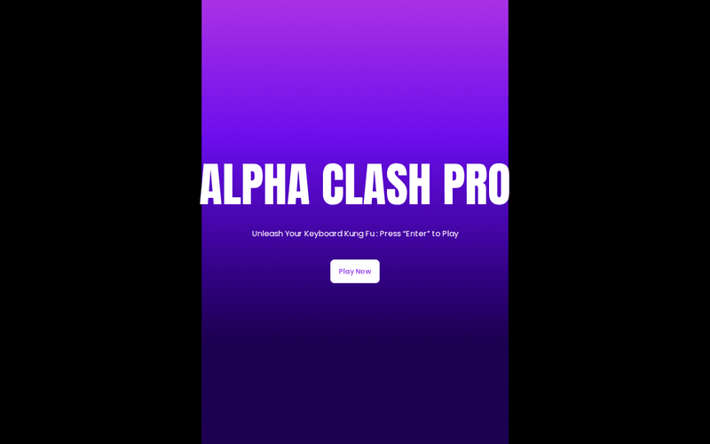
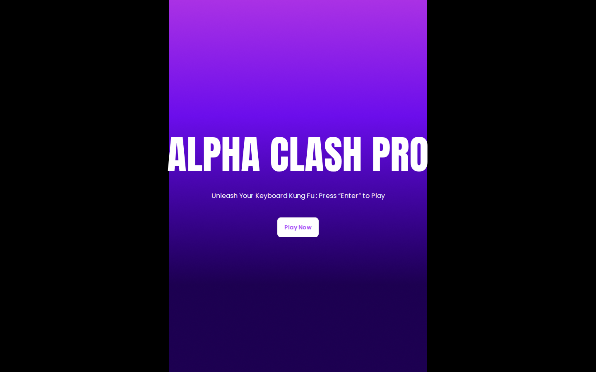
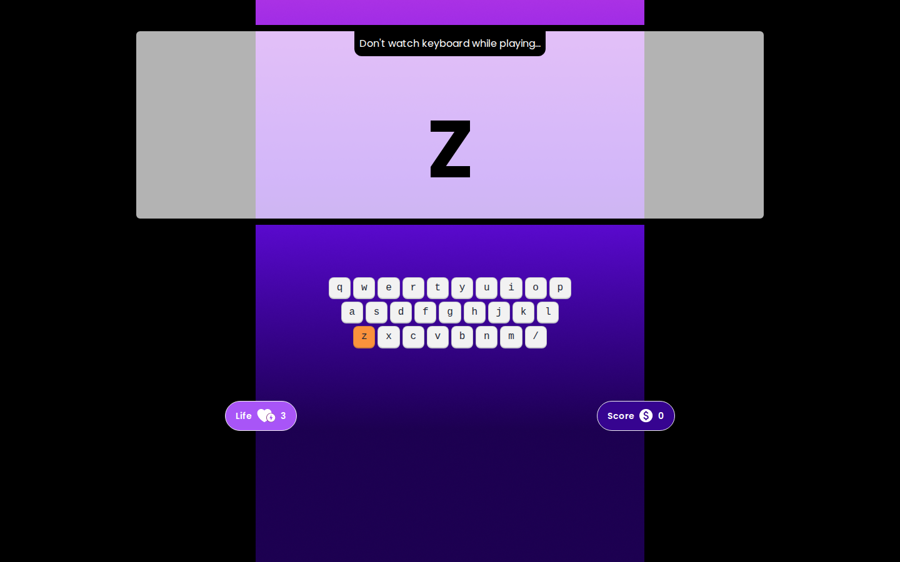
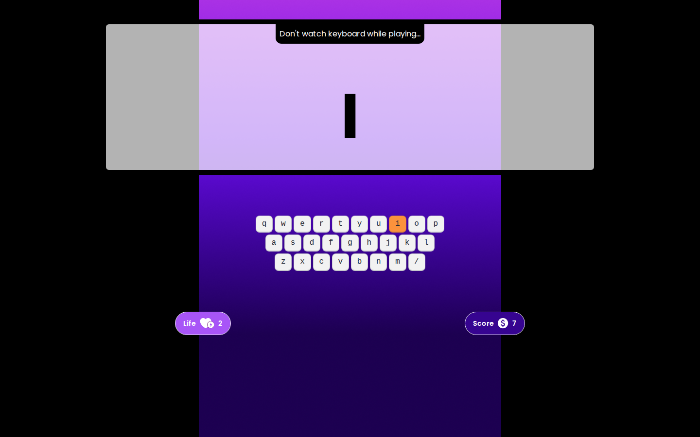
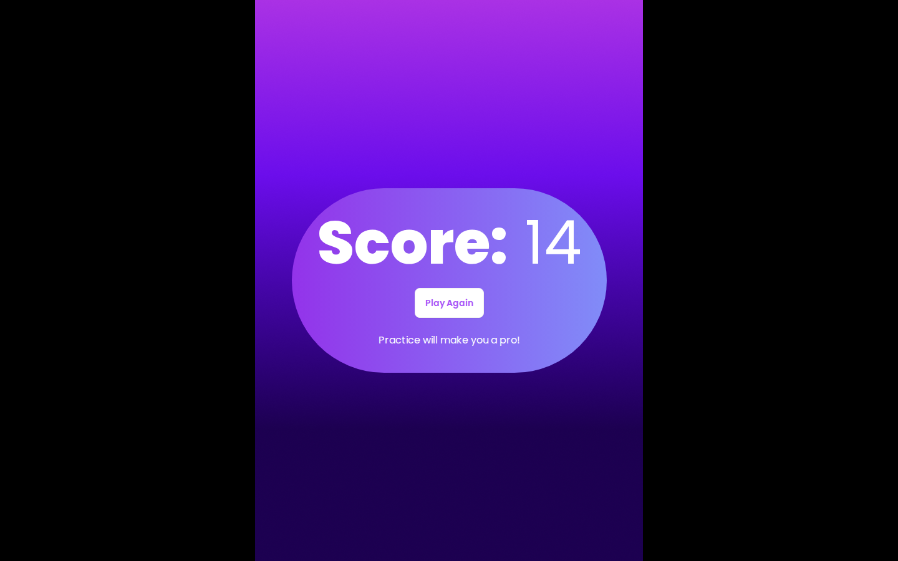

# ALPHA CLASH PRO

A browser typing game: press the letter that lights up before you run out of lives.

<p align="center">
  
</p>

<table>
  <tr>
    <td align="center" width="25%"><a href="screenshots/home.png"></a><br><sub><b>Home</b></sub></td>
    <td align="center" width="25%"><a href="screenshots/gameplay.png"></a><br><sub><b>Round start</b> · target key lit</sub></td>
    <td align="center" width="25%"><a href="screenshots/mid-round.png"></a><br><sub><b>Mid-round</b> · score 7, 2 lives</sub></td>
    <td align="center" width="25%"><a href="screenshots/game-over.png"></a><br><sub><b>Game over</b></sub></td>
  </tr>
</table>

Typing practice usually means repeating drills. ALPHA CLASH PRO turns it into a short arcade round: a random letter appears on screen and on a virtual keyboard, and you press it on your real keyboard as quickly as you can, ideally without looking down. It's a small static page with no build step, so it's quick to run and easy to read.

## Quick Start

```bash
git clone https://github.com/SHAYAN-ABRAR/ALPHA-CLASH-PRO-Game.git
cd ALPHA-CLASH-PRO-Game
python3 -m http.server 8000
```

Open <http://localhost:8000> and click **Play Now**. On Windows, use `python` instead of `python3`. Opening `index.html` directly in a browser works too. Tailwind CSS, DaisyUI and the fonts load from CDNs, so you need an internet connection.

## Features

- **Three screens:** home, playground and game over, switched by small show/hide helpers in `utility.js`.
- **Random target letter:** a new letter from a to z after every correct key.
- **On-screen QWERTY keyboard:** built from DaisyUI `kbd` components, with the target key highlighted.
- **Live scoreboard:** separate life and score counters update on every key press.
- **Keyboard-only rounds:** one `keyup` listener handles all input, so you don't need the mouse while playing.

## How to Play

1. Click **Play Now**.
2. A letter appears on the screen and its key turns orange on the on-screen keyboard. Press that key.
3. A correct key scores 1 point and brings up a new letter. A wrong key costs 1 life.
4. You start with 3 lives. When they run out, the game-over screen appears.

## Configuration

The starting number of lives is set in the markup. To make the game easier or harder, change the `3` in `index.html`:

```html
<span id="currentLife">3</span>
```

## Known Limitations

- The game-over screen shows a fixed score (`14`) written in the HTML, not the score you reached.
- **Play Again** returns to the playground but doesn't reset the score or lives.
- The home screen says to press Enter, but only the **Play Now** button starts a round.

## Tech Stack

- HTML5
- Tailwind CSS (Play CDN) and DaisyUI 4.7.2
- Google Fonts: Poppins and Anton
- Vanilla JavaScript (`alpha-clash.js` for game logic, `utility.js` for helpers)

## Project Structure

```text
ALPHA-CLASH-PRO-Game/
├── index.html          # Home, playground and game-over sections
├── alpha-clash.js      # Key handling, scoring, lives, game over, replay
├── utility.js          # Random letter, key highlight, show/hide helpers
├── styles.css          # Font classes (Poppins, Anton)
├── tailwind.config.js
├── images/             # Background and scoreboard icons
└── screenshots/        # README images
```

## Contributing

Bug reports and ideas are welcome. Please [open an issue](https://github.com/SHAYAN-ABRAR/ALPHA-CLASH-PRO-Game/issues) to describe the problem or suggestion. Please read the license note below before reusing any code.

## License

This repository doesn't have a license yet, so it doesn't grant anyone permission to reuse or redistribute its code or assets. Please ask before reusing any part of it.

---

Built by **Shayan Abrar** · [GitHub](https://github.com/SHAYAN-ABRAR) · [LinkedIn](https://www.linkedin.com/in/shayan-abrar/)
